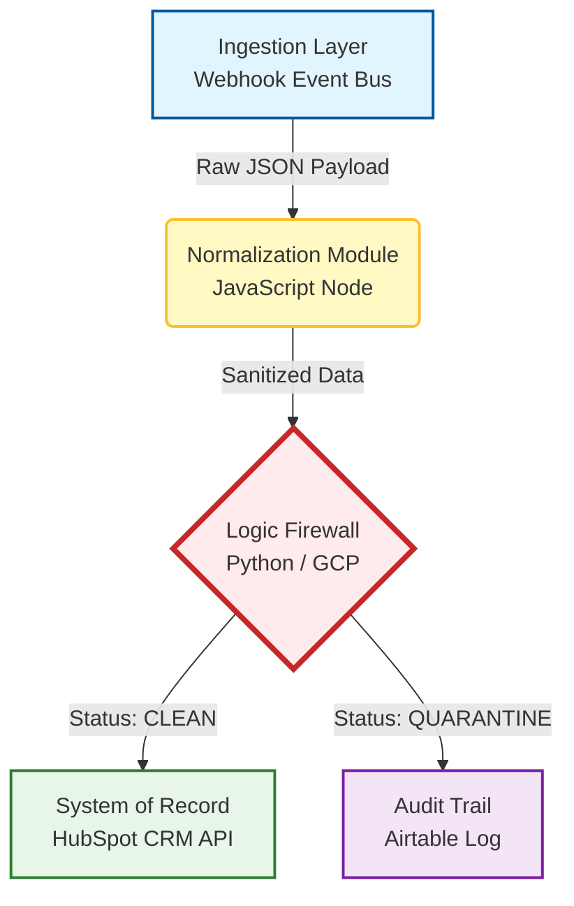

# The Clean-Signal Revenue Engine

-F7DF1E?style=for-the-badge&logo=javascript&logoColor=black)

> **A Glass Box middleware designed to enforce strict data hygiene and deterministic governance between enrichment sources and Enterprise Systems of Record.**

---

## System Overview

**The Clean-Signal Revenue Engine** is a Glass Box architectural pattern designed to solve the **Data Integrity & Poisoning** problem in modern AI-driven GTM stacks.

This system acts as a **Logic Firewall**. It intercepts high-velocity payloads from enrichment sources (Clay, Clearbit), performs deterministic sanitization and risk analysis, and only commits validated data to the CRM (HubSpot).

**Key Architectural Principle:** Trust but Verify. We decouple data ingestion from data commitment using a strict governance layer.

This system acts as a Logic Firewall. It intercepts high-velocity payloads from enrichment sources (Clay, Clearbit), performs deterministic sanitization and risk analysis, and only commits validated data to the CRM (HubSpot).

Key Architectural Principle: Trust but Verify. We decouple data ingestion from data commitment using a strict governance layer.

The Problem: Downstream Data Pollution
In high-velocity GTM architectures, Speed often compromises Safety. Automated enrichment pipelines frequently introduce Toxic Data Assets into the System of Record (SoR):

Unstructured Noise: Raw legal entity suffixes (Inc., LLC, GmbH) break deduplication logic.
Risk Exposure: High-risk entities (Bankruptcies, Litigation, Sanctions) enter the sales pipeline undetected.
LLM Hallucinations: Downstream AI agents ingest dirty context, leading to inaccurate generation and reputational damage.
The result: Technical debt, broken data lineage, and compliance failures.

The Solution: Deterministic Glass Box Middleware
This project implements a Governance-First Architecture. It is not a probabilistic AI wrapper; it is a deterministic auditing system.

The Architecture Stack
Orchestrator: n8n  Manages the event bus and workflow state.
Compute : Python 3.10  Performs heuristic risk analysis.
Normalization: JavaScript – Handles Regex-based string sanitization.
System of Record: HubSpot CRM.
Audit Log: Airtable  Provides immutable transaction logs for compliance.

Data Flow Architecture

Ingestion Layer
Trigger: Webhook receives JSON payloads from enrichment providers.
Protocol: Asynchronous processing to handle high-concurrency bursts without blocking the source.

The Laundromat
Technology: JavaScript Node.
Function: Executes Regex-based sanitization to strip legal entity suffixes and standardize formatting.
Input: "Acme Corp Inc."
Output: "Acme" Ready for fuzzy matching.

The Logic Firewall (Risk Analysis Microservice)
Technology: Python .
Function: Scans unstructured text (News, Descriptions) for risk vectors using a Root-Word Heuristic Engine.
Risk Roots: bankrupt, fraud, investigat, litigat, sanction.
Output: Returns a binary CLEAN or QUARANTINE status with a descriptive reason code.

Governance Routing & Auditing 
Path A (Clean): Data is batched and committed to HubSpot via the CRM API. 
Path B (Quarantine): Risky data is routed to an Exception Log (Airtable) for Human-in-the-Loop (HITL) review. 
Audit Trail: Every transaction whether accepted or rejected is logged with a timestamp and decision rationale to ensure full Data Lineage.

**About the Architect**  
Zimkitha Ntshikaniso is an AI Solutions Architect specializing in GTM Systems Architecture and Glass Box Middleware.

I build systems that make AI safe for the Enterprise. My focus is on Operational Reliability, Data Governance, and Deterministic Work.
